# 🚀 RazorRecovery 
**Built for the Razorpay Buildathon**

> **Disclaimer:** The name "RazorRecovery" and the accompanying blue logo are used strictly for thematic purposes as this is a conceptual product built exclusively for the Razorpay Buildathon. This project is an independent hackathon submission and is not an official Razorpay product.
>
> **Note on Presentation Data:** While this application fully integrates with live Razorpay Webhooks and APIs, certain analytical dashboards (such as Revenue Leaks, Recovery Memory, and 7-day Trend Graphs) have been pre-seeded with synthetic, realistic data. This is solely to effectively demonstrate the UI's rendering capabilities at a high transaction volume for the Buildathon judges.

RazorRecovery is an **AI-driven Revenue Recovery Control Plane** for enterprise merchants. It doesn't just blindly chase failed payments with spam emails. It mathematically analyzes payment failures, simulates recovery strategies, and autonomously executes the most profitable action to maximize **Net Recovered Revenue**.

---

## 🧠 What It Does

When a customer's payment fails at checkout, RazorRecovery steps in instantly:
1. **Webhook Interception:** Securely catches `payment.failed` webhooks directly from Razorpay using HMAC-SHA256 validation.
2. **AI Counterfactual Analysis:** Feeds the entire customer history and checkout context into an LLM (powered by Ollama/Gemma). The AI predicts the probability of recovery using different strategies (e.g., standard Payment Link vs. Payment Link + 10% Voucher).
3. **Deterministic Execution:** The AI's decision is passed through a strict Merchant Policy Engine. If approved, RazorRecovery uses the Razorpay API to generate a targeted Payment Link and sends it to the customer.
4. **Learning & Lab:** Records the outcome to build a "Recovery Memory", ensuring the AI gets smarter over time.

---


---

## ⚡ Key Features

* **Recovery Autopilot:** Fully autonomous failure detection and recovery execution using the Razorpay API.
* **Counterfactual AI:** Mathematically estimates *Gross Recovery* vs *Incentive Cost* before taking action.
* **Recovery Copilot:** A built-in natural language terminal. Ask the AI: *"Why did my UPI success rate drop today?"* or *"Summarize my active revenue leaks."*
* **Recovery Lab (A/B Testing):** Safely route a small percentage of failed checkouts to experimental strategies to prove mathematical ROI before full rollout.
* **Insights Engine:** Scans the macro-funnel to find systemic revenue leaks across the entire store.
* **Local-First AI:** Built to route securely through a local Ollama cloud daemon (e.g., `gemma4:31b-cloud`) keeping merchant data private.

---

## 🛠️ Tech Stack

* **Frontend:** Next.js 16 (App Router), Tailwind CSS, Framer Motion, shadcn/ui.
* **Backend:** Next.js API Routes, Prisma ORM, SQLite.
* **AI Integration:** Native REST integration with Ollama (Local/Cloud).
* **Payments & Webhooks:** Razorpay Node SDK.
* **Networking:** Cloudflare Tunnels for live webhook interception.

---

## ⚙️ Environment Setup & API Keys

> ⚠️ **Kindly Use Your Own Keys:** The `.env` file is excluded from git for credential security. To run RazorRecovery with your own Razorpay test account and AI features, set up your local environment:
>
> 1. Copy the sample environment template:
>    ```bash
>    cp .env.example .env
>    ```
> 2. Populate `.env` with your credentials:
>    - **Razorpay API Keys:** (`RAZORPAY_KEY_ID`, `RAZORPAY_KEY_SECRET`) — Generate from [Razorpay Dashboard → Settings → API Keys](https://dashboard.razorpay.com/app/keys).
>    - **Razorpay Webhook Secret:** (`RAZORPAY_WEBHOOK_SECRET`) — Create a webhook in Razorpay Dashboard pointing to `https://<your-tunnel-url>/api/webhooks/razorpay` with events `payment.failed`, `order.paid`, `payment_link.paid`.
>    - **AI Intelligence Key:** (`AI_PROVIDER_API_KEY`) — Your Groq, OpenAI, or Ollama endpoint key for counterfactual analysis and Copilot.
>    - **SMS Recovery (Optional):** (`SMS_PROVIDER`, `TWILIO_*`) — Configure Twilio credentials for real-time customer SMS recovery links, or leave blank to use the built-in simulated console delivery.
>    - **Push Notifications (Optional):** (`NTFY_TOPIC`) — Real-time merchant push notifications via [ntfy.sh](https://ntfy.sh).

---

## 🎮 How to Demo / Test

Because RazorRecovery is built for production, you cannot just test it with a standalone link. You must simulate a real e-commerce checkout loop.

1. **Start the Platform:**
   ```bash
   npm run dev
   ```

2. **Start the Webhook Tunnel (New Terminal):**
   ```bash
   cloudflared tunnel --url http://localhost:3000
   ```
   *(Copy the generated HTTPS URL and paste it into your Razorpay Dashboard Webhooks settings).*

3. **Generate a Custom Checkout:**
   Navigate to `http://localhost:3000/demo`. Enter custom customer details and click **Generate**.

4. **Fail the Payment:**
   You will be redirected to a simulated storefront. Click **Pay**. When the Razorpay Test Modal opens, select a payment method and explicitly click **Failure**.

5. **Watch the AI Work:**
   Go to `http://localhost:3000/recoveries`. You will instantly see the AI intercept the webhook, analyze your custom checkout, and propose a live recovery plan!

---

*Designed with a "Quiet-Luxury" Fintech aesthetic for maximum clarity and control.*


---

## 📚 Comprehensive Feature Documentation

> The following sections detail the core architecture, capabilities, and technical features of RazorRecovery, compiled from our documentation library.


### Architecture

# Architecture

RazorRecovery is designed as a secure orchestration pipeline rather than a generic CRUD app.

```text
Commerce Data
↓
Detection (RecoveryEligibilityService)
↓
Recovery Intelligence (AI generates options & Net Recovery estimate)
↓
Policy (Evaluates maximum discount, contact frequency)
↓
Execution (RecoveryPlanService handles async execution steps)
↓
Verification (Webhook Event Processor ensures idempotency)
↓
Learning (Outcome mapped to RecoveryLearningEvent)
↓
Insights (RevenueLeaks generated asynchronously)
↓
Copilot (Context-aware querying engine)
```

## Tenets
1. **AI is not an authority**: AI produces `AIDecision` and `RecoveryOption` records. These are inputs to the `PolicyEngine`. AI never executes a payment, refund, or discount directly.
2. **Financial Precision**: All monetary values are handled as integer minor units (e.g., paise).
3. **Idempotency**: Webhook events, detection events, and execution events all enforce idempotency keys to prevent duplicate billing or notification.


### Buildathon Demo

# Buildathon Demo Guide

Target Duration: 5-8 minutes

## 1. Overview (1 min)

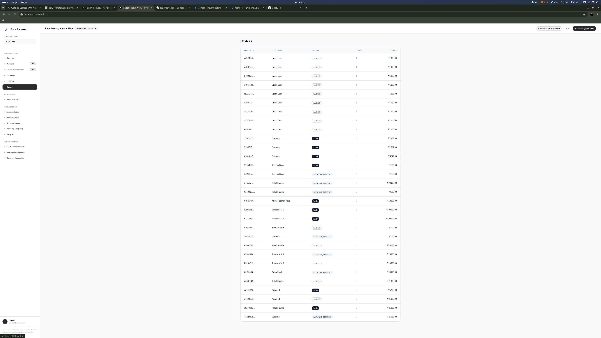

- **Goal:** Show the core product value.
- Start at the `/` Overview dashboard. Point out "Revenue at Risk" and "Net Recovered".
- Highlight the "What RazorRecovery Learned" section. Emphasize that this is not a static tool; it is actively improving based on past recovery outcomes.

## 2. Revenue at Risk -> Golden Case (2 mins)

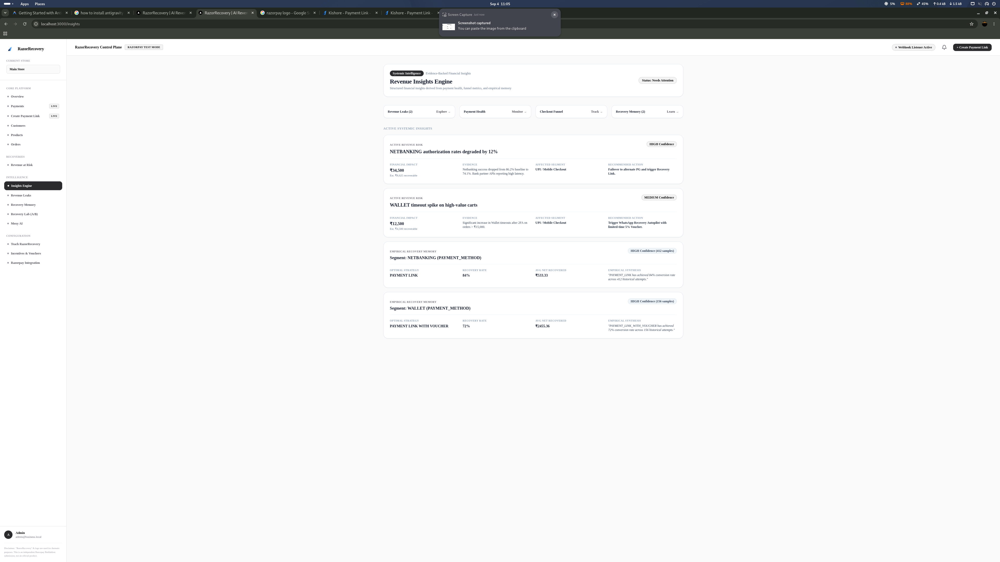

- Navigate to `/recoveries`. Click on the most recent case for **Rahul Sharma (Nike Air Max 270)**.
- **Narrative:** "Rahul's UPI payment failed. Normally, you'd send a generic payment link. But look what RazorRecovery did."
- Show the AI Recommendation and Counterfactuals (Prediction vs Reality if already completed).
- Explain how the AI chose the action based on maximum *Net* recovered revenue.

## 3. Recovery Lab (1.5 mins)

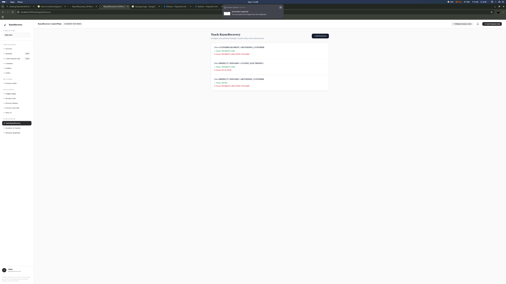

- Go to `/recovery-lab`.
- Show how a merchant can create A/B tests (e.g., Payment Link vs Voucher) in a strictly controlled manner with budget limits.
- Show `/settings/preferences` (Teach RazorRecovery) where merchants can hardcode behaviors that the AI strictly follows (e.g., "Always use Payment Link for Returning Customers").

## 4. Copilot (1.5 mins)

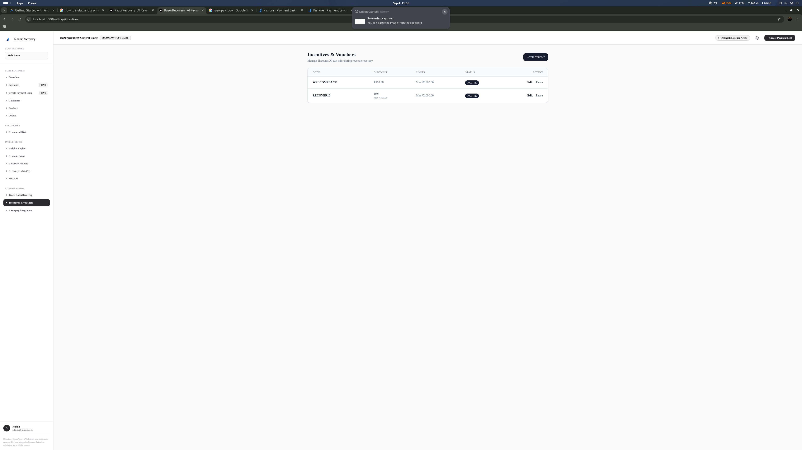

- Open `/copilot`.
- **Query 1:** "What is my revenue summary for this month?" (Shows context retrieval).
- **Query 2:** "Show me active revenue leaks." (Shows insight capability without hallucinations).
- Point out that Copilot cannot move money—it only proposes actions requiring approval.

## 5. Insights (1 min)

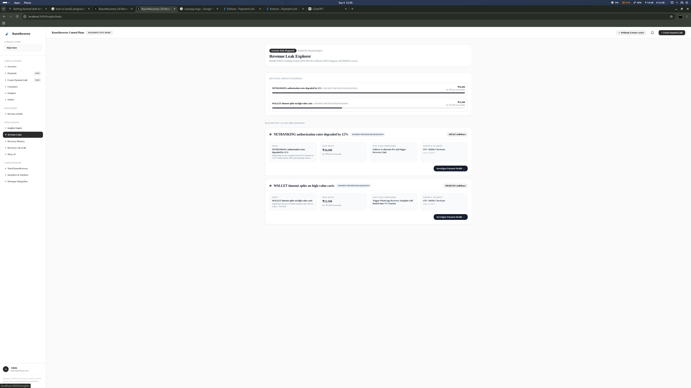

- Briefly show `/insights/leaks`.
- Show how RazorRecovery detects funnel degradation (e.g., UPI failures spiking by 15%) saving the merchant far more than just a single abandoned cart.


### Commerce Data Model

# Commerce Data Model

The RazorRecovery data architecture maps out the complete customer journey, explicitly separating checkout intention from actual payment processing. This separation is required to correctly differentiate **Checkout Abandonment** from **Payment Failures** for the future Recovery Engine.

## Core Models

### 1. `Customer`


Belongs to a `Store`. Stores contact information and unique `externalCustomerId` references. Customers contain multiple `Orders` and `CheckoutSessions`.

### 2. `Product`

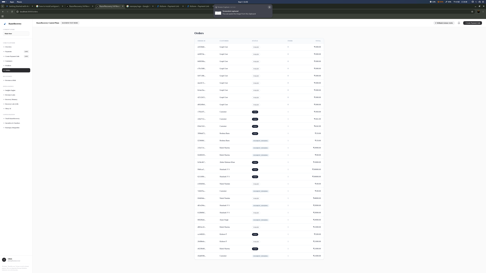

Belongs to a `Store`. Defines standard product details, SKU, and a `price` (stored consistently in *integer minor units*). Avoids floating point inaccuracies. Inventory states (`IN_STOCK`, `LOW_STOCK`, `OUT_OF_STOCK`, `UNKNOWN`) are supported natively.

### 3. `Cart` & `CartItem`
Belongs to a `Store` (and optionally a `Customer` for Guest Checkouts in future). Represents the transient pre-checkout state. 

### 4. `Order` & `OrderItem`
Created upon moving to the Checkout phase. `OrderItem` preserves `productNameSnapshot` and unit prices at the time of purchase ensuring future product mutations don't incorrectly retroactively alter historical orders. Subtotal, Tax, Shipping, and Total are stored in integer minor units.
An order's status (`CREATED`, `PAYMENT_PENDING`, `PAID`, `FAILED`, `CANCELLED`, `REFUNDED`) is independent of any single payment attempt.

### 5. `CheckoutSession` & `CheckoutEvent`
Crucial entity representing the *Journey*. Contains the `startedAt`, `lastActivityAt`, and an ordered list of `CheckoutEvent`s (`PRODUCT_VIEWED`, `ADDED_TO_CART`, `CHECKOUT_STARTED`, `PAYMENT_METHOD_SELECTED`, `PAYMENT_ATTEMPTED`, `PAYMENT_FAILED`, `PAYMENT_COMPLETED`, `CHECKOUT_ABANDONED`).

### 6. `Payment`
A one-to-many relationship attached to `Order`. Maps `method` (UPI, CARD, etc.), and in the future, standardizes integrations with the Razorpay Webhook Engine (`razorpayPaymentId`). Maintains granular status like `AUTHORIZED`, `CAPTURED`, `FAILED`.

## Tenant Isolation Boundary
All queries must execute via `withTenant(merchantId)` wrapper resolving the active authenticated user session. Every child entity is validated against its Parent `Store`, mapping back to the `Merchant`. Client-side IDs are strictly validated during fetching.


### Copilot Prompt Injection

# Copilot Prompt Injection Defense

Prompt injection is prevented through architectural separation:

1. **Read-Only State:** The AI uses a restricted API key that can only query read models if we migrate to an Agentic architecture. Currently, it's a stateless inference call.
2. **Untrusted Data Boundaries:** Customer names, checkout metadata, and order payloads are stringified into a rigid context block. The system prompt explicitly commands the model not to accept operational commands from this block.
3. **Structured Outputs:** By enforcing Zod JSON schema, malicious text injections that attempt to break structure are rejected.
4. **No Direct Execution:** Even if an injection forces an "action", it merely drops a `PROPOSED` row into the database. It cannot execute.


### Copilot Security

# Recovery Copilot

The Recovery Copilot translates natural language into secure, structured data retrievals and scoped action proposals.

## Security Model
The Copilot is an orchestration layer, **not a financial authority**. It never directly modifies the payment state or database metrics. It relies entirely on `CopilotActionProposal`, which mandates explicit human review and adherence to the Policy Engine.

## Zod Validation
The LLM response is strictly validated against a predefined JSON schema ensuring an `intent`, an `answer`, optional `evidence`, and optionally structured `actions`.


### Customer Recovery Dna

# Customer Recovery DNA

Customer Recovery DNA uses historical transaction/recovery behavior to categorize customers into segments like `NEW_CUSTOMER` or `RETURNING_CUSTOMER`.

## Principles
- No sensitive profiling (demographics, health, political). 
- Based entirely on purchase and recovery history (payment method, failure type, lifetime spend).

Memory aggregates by these segments to learn, for instance, that `RETURNING_CUSTOMER` groups might respond to Payment Links alone without needing to subsidize a voucher.


### Experiment Learning

# Experiment Learning Loop

When an experiment completes, the data is fed back into the AI's collective intelligence.

## Data Pipeline
1. `RecoveryOutcomeService` calculates the verified Net Recovered amount.
2. If the case has an `experimentAssignmentId`, the result is logged to `RecoveryLearningEvent` with `sourceType = "EXPERIMENT"`.
3. The `RecoveryExperimentArm` receives an aggregated real-time tally of `grossRecovered`, `incentiveCost`, and `netRecovered`.
4. The `MemoryService` consumes the learning event asynchronously, adjusting the historical success probability that future simulations and AI decisions will query.


### Experiments

# Recovery Experiments

Controlled experiments allow merchants to scientifically measure the causal impact of different recovery interventions.

## Architecture
- **RecoveryExperiment**: Defines the hypothesis, budget limit, and sample targets.
- **RecoveryExperimentArm**: Defines the control and variant strategies.
- **ExperimentAssignmentService**: Hooks into the AI eligibility pipeline. If a case matches an active experiment, it is deterministically assigned to an arm (via ID parity).

## Safety & Budget
Experiments tracking incentives (e.g., Vouchers) enforce a `budgetLimit`. Once `currentSpend` reaches the limit, the assignment falls back to standard AI/Policy routing to prevent unbounded financial risk.


### Insights Engine

# Insights Engine

The Insights Engine bridges raw analytics and human-readable advice.

It combines:
- Active Revenue Leaks
- Payment Health
- Recovery Memory
- Autopsy Feedback

## Priority
Insights are mathematically ranked by `affectedRevenue` and `severity`. The engine does *not* auto-disable or financially alter payment methods. It provides deterministic, localized insights for merchants to review safely.


### Learning System

# Learning System

The Learning Loop orchestrates safe, autonomous continuous improvement without unconstrained model self-modification.

1. **Outcome:** A webhoook validates a successful payment.
2. **Learning Event:** An immutable `RecoveryLearningEvent` is logged containing contextual features.
3. **Memory Aggregation:** `RecoveryMemory` updates success rates, net recovery, and computes `confidence` thresholds (Low < 5, Medium 5-19, High 20+).
4. **Retrieval:** The next identical failure prompts retrieval of this memory.
5. **AI Inference:** The AI reads the historical data directly inside the prompt context and recommends the mathematically optimal historical strategy.


### Merchant Preferences

# Merchant Preferences (Teach RazorRecovery)

Merchants can "teach" the AI their business heuristics via the **MerchantRecoveryPreference** model.

## Decision Flow
1. AI receives the standard Context + Memory.
2. AI also receives active Merchant Preferences.
3. The prompt explicitly instructs the AI to adhere to these preferences.
4. **Safety Net**: Regardless of the AI output, the **Policy Engine** evaluates the final recommendation. If a merchant sets a preference that violates a safety policy, the policy engine blocks the execution.

## Example
Scope: `CUSTOMER_SEGMENT`
Condition: `NEW_CUSTOMER`
Avoided Strategy: `PAYMENT_LINK_WITH_VOUCHER`


### Notification System

# Notification System

Outbound communication uses an explicit abstraction `NotificationProvider`.

## Simulated Truthfulness
If no third-party provider (e.g. Twilio or Gupshup) is wired up, the notification is explicitly marked as `SIMULATED` with a delivery state of `NOT_APPLICABLE`. The UI will reflect "Simulation — not delivered". The application *never* fakes delivery success.

## Context Injection
Variables injected into the notification (customer name, store name, Razorpay Payment Link) are sourced from canonical database entities. Untrusted user inputs are discarded.


### Policy Engine

# Policy Engine

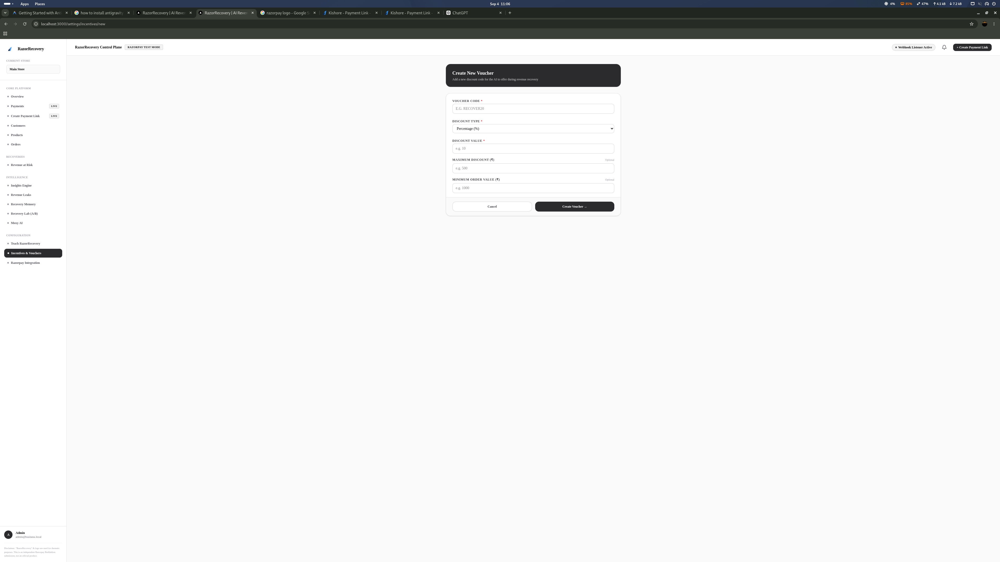

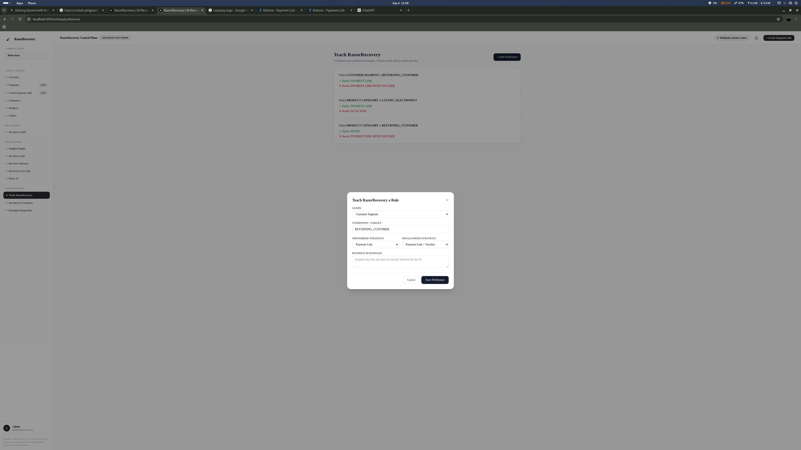

The RazorRecovery Policy Engine sits deterministically between the AI's recommendations and real financial execution.

## Rules Enforced
1. **Disabled Autopilot**: Requires human approval if disabled.
2. **Value Limits**: Order amount > `maximumAutomaticRecoveryAmount` triggers mandatory human approval.
3. **Discount Checks**: `maximumDiscountPercent` and `maximumDiscountAmount` strictly block excessive discounts.
4. **Contact Limits**: Halts campaigns attempting to exceed `maximumContacts`.
5. **Recovery Window**: Drops expired recovery cases based on `recoveryWindowHours`.
6. **Payment Status Safety**: Blocks execution immediately if order becomes PAID, REFUNDED, or CANCELLED.

## PolicyEvaluations
Every analysis outputs a `PolicyEvaluation` record. This guarantees an immutable audit trail of exactly *why* a particular strategy was allowed, required approval, or was blocked at that exact moment in time.


### Prediction Vs Reality

# Prediction vs Reality

To ensure explainability, AI predictions are *never* overwritten by actual outcomes.

When an `AIDecision` is generated, the `RecoveryOption` locks in the `predictedGrossRecovery`, `predictedIncentiveCost`, and `predictedNetRecovery`.

Once the `RecoveryOutcome` resolves, the actual metrics are calculated and displayed side-by-side in the Case Detail UI. This persistent contrast forms the baseline for calculating prediction error and tuning the model weighting.


### Product Recovery Dna

# Product Recovery DNA

Similar to Customer DNA, Recovery Memory segments outcomes by `PRODUCT`.

## Intelligence
By tracking the `averageIncentiveCost` and `grossRecovered` per `PRODUCT`, the memory system can inform the AI whether a high-margin item historically requires an incentive to recover, or if standard outreach suffices. This isolates optimal strategies down to the SKU level over time.


### Razorpay Integration

# Razorpay Integration

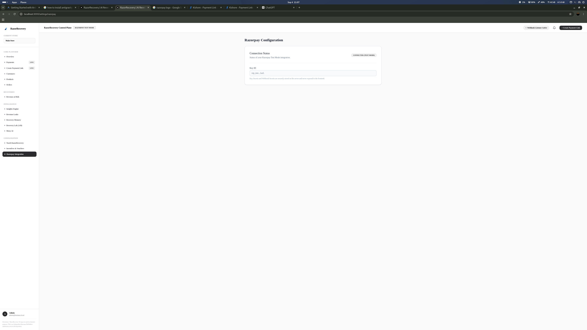

The Razorpay integration handles actual Payment interactions securely via Server Actions and Next.js Webhooks.

## Environment Variables
- `RAZORPAY_KEY_ID`: Used to initialize the `razorpay` SDK in test or live mode.
- `RAZORPAY_KEY_SECRET`: Private secret for creating orders and fetching payment information. **Never exposed to the frontend.**
- `RAZORPAY_WEBHOOK_SECRET`: Secure string used to cryptographically verify incoming webhook payloads.

## Webhooks

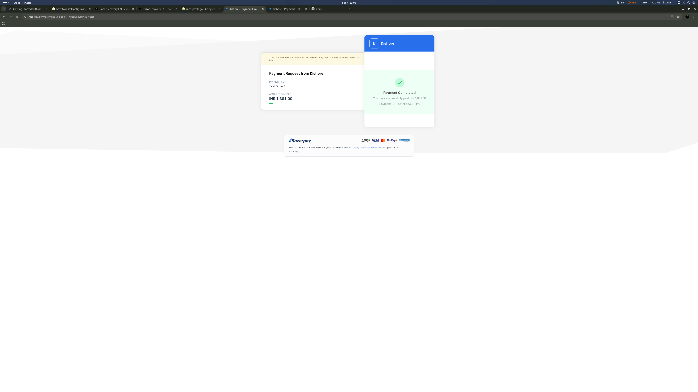

Located at `POST /api/webhooks/razorpay`.
- **Signature Verification**: We compute an `HMAC-SHA256` signature using the raw request body and compare it with the `x-razorpay-signature` header via `crypto.timingSafeEqual`.
- **Idempotency**: All processed events are recorded in `WebhookEvent` mapping `providerEventId` (using `x-razorpay-event-id`). Any duplicate hits are instantly ignored returning a 200 OK.
- **Transactional Updates**: When `payment.captured` or `payment.failed` is received, we execute a Prisma `$transaction` combining `payment` creation and `order` state updates synchronously.

## Payment Links

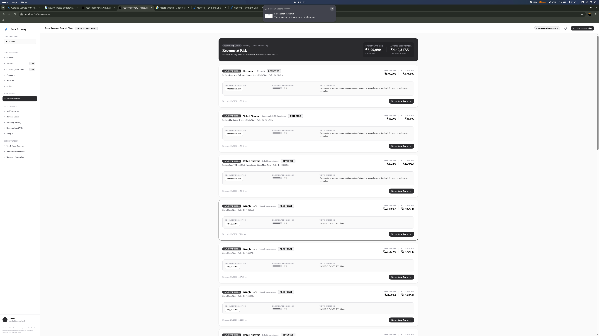

We support Payment Link creation natively via `RazorpayService.createPaymentLink`. The resulting short URLs and provider metadata are tracked locally inside the `PaymentLink` model to facilitate subsequent SMS/Email recoveries in future chunks.


### Recovery Autopilot

# Recovery Autopilot

Autopilot evaluates whether human intervention is required before contacting a customer.

## Logic
When `automaticRecoveryEnabled = true` AND the Policy Engine evaluates the AI's selected recovery strategy as `allowed`, the case progresses automatically to `RECOVERING`. 
If `automaticRecoveryEnabled = false` or a threshold triggers `approvalRequired = true`, the system pauses the case in `AWAITING_APPROVAL` and waits for merchant authorization.

## Approvals
The `ApprovalRequest` record acts as the holding mechanism. When a merchant (Admin/Owner) approves, the system generates the Recovery Plan based on the snapshot of the AI decision that was just approved, proceeding seamlessly into `RECOVERING`.


### Recovery Autopsy

# Recovery Autopsy

The Autopsy breaks down a completed recovery case (whether Successful or Failed) to provide transparent feedback loop visibility.

It explicitly maps:
- **Diagnosis:** The AI's original classification.
- **Action:** The AI's chosen intervention.
- **Prediction:** The mathematically locked-in Net Recovered forecast.
- **Reality:** The absolute, webhook-verified Net Recovered result.
- **Lesson:** The confirmation that this specific vector is now folded into the canonical Recovery Memory for future AI context retrieval.


### Recovery Engine

# Recovery Intelligence Engine

RazorRecovery evaluates checkout abandonment and payment failures using a deterministic eligibility layer combined with an AI-driven counterfactual strategy engine.

## Lifecycle
1. **DETECTED**: A verified payment failure triggers `RecoveryEligibilityService`. Idempotency guarantees exactly one `RecoveryCase` is created per risk reason for an order.
2. **ANALYZING**: The `RecoveryAnalysisService` gathers context (historical success/fail rates, order values, checkout stages) and queries the AI model (e.g., Llama 3 via Groq) for structured JSON decisions.
3. **ACTION_READY**: The optimal recovery strategy is identified. No execution occurs automatically.

## Counterfactual Strategies
For every case, multiple strategies (e.g., `NO_ACTION`, `PAYMENT_LINK`, `RETRY`, `PAYMENT_LINK_WITH_VOUCHER`) are compared. The system computes expected values deterministically from AI probability estimates.

### Expected Net Recovery Calculation
```
Expected Gross Recovery = Predicted Gross
Expected Net Recovery = Max(0, Expected Gross - Predicted Incentive Cost)
```
The strategy with the highest **Expected Net Recovery** is recommended.

## Opportunity Score
The Opportunity Score normalizes the expected net recovery against the total risk amount and probability:
```
Score = (Highest Expected Net Recovery / Risk Amount) * Recovery Probability * 100
```
This is capped at a maximum of 100 and displayed in the UI as a percentage indicator.


### Recovery Lab

# Recovery Lab

The Recovery Lab is the command center for controlled experimentation and continuous learning within RazorRecovery.

## Core Features
1. **Experiments**: A/B test recovery strategies (e.g., Payment Link vs Payment Link + Voucher) safely.
2. **Strategy Simulator**: Use historical Recovery Memory to estimate what *would* have happened under a different strategy for a specific context.
3. **Teach RazorRecovery**: Provide explicit merchant preferences (e.g., "Always require approval for VIPs") that the AI integrates into its decision matrix.

## Safety First
All actions within the Recovery Lab are constrained by the **Policy Engine**. Experiments cannot bypass maximum discount rules, approval gates, or contact limits.


### Recovery Memory

# Recovery Memory

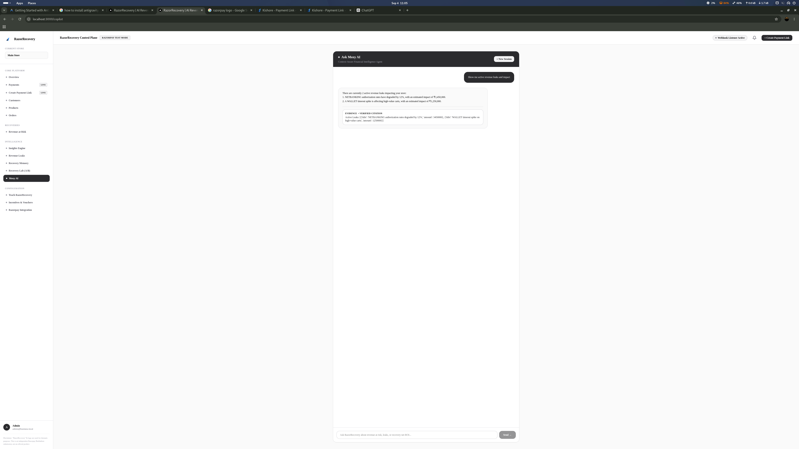

RazorRecovery aggregates actual historical recovery outcomes to answer: *"Which recovery strategy works best in this situation?"*

## Architecture
Every `RecoveryOutcome` calculation creates a canonical `RecoveryLearningEvent`.
The `MemoryService` aggregates these asynchronously into `RecoveryMemory` records segmented by:
- `PAYMENT_METHOD`
- `CUSTOMER_SEGMENT`
- `PRODUCT`

## Contextual Retrieval
Before the AI proposes a new strategy, the Intelligence Engine queries the Memory Service with the current case's context. If historical memory exists, it is appended to the AI's prompt as grounded, factual historical evidence to steer the recommendation toward historically superior strategies.


### Recovery Outcomes

# Recovery Outcomes

A Recovery Outcome is deterministically created *only* when a verified successful payment is captured through the system.

## Statuses
- **RECOVERED**: The captured payment amount + actual incentive discount is equal to or greater than the original order risk amount.
- **PARTIALLY_RECOVERED**: The captured payment amount + actual incentive discount is less than the original order risk amount.
- **FAILED / EXPIRED / STOPPED**: Fallbacks for unsuccessful paths.

## Stop Execution
When an outcome evaluates to `RECOVERED` or `PARTIALLY_RECOVERED`, all pending `RecoveryPlanSteps` immediately transition to `CANCELLED` safely blocking any further duplicate links, retry attempts, or SMS pings.


### Recovery Plan

# Adaptive Recovery Plan

The `RecoveryPlan` replaces static linear follow-ups with an adaptive strategy that halts or branches according to external payment state dynamically.

## Step Types
- `PAYMENT_LINK`: Connects securely to the provider SDK to create a short url and maps it back.
- `MESSAGE`: Integrates through `NotificationProvider` to email/SMS/simulate outreach.
- `WAIT`: Stalls the step progression by mapping `delaySeconds` to `scheduledAt`.
- `CHECK_STATUS`: Authoritatively polls the provider, updating the internal status.

## Stop Conditions
The `RecoveryStopService` runs *before every step*.
If the payment succeeds, the order is cancelled, or the recovery window expires, remaining steps transition safely to `CANCELLED` and the overarching plan transitions to `STOPPED`. 
This guarantees the system will never accidentally send a "payment failed" message to a customer who has already paid.


### Revenue Accounting

# Revenue Accounting

Financial data is strictly processed in integer minor units (e.g., paise).

## Gross vs Net
- **Gross Recovered Revenue**: The *exact* amount captured successfully via Razorpay that maps directly back to the Recovery Case.
- **Incentive Cost**: The *exact* discount amount granted via a `VoucherRedemption` directly attributable to this specific transaction.
- **Net Recovered Revenue**: `Gross - Incentive`.

## Partial Recovery
If the recovered amount does not cover the complete value of the `riskAmount`, it is handled safely as a partial recovery.
Net expected vs Actual prediction metrics are frozen and tracked independently in the `RecoveryLearningEvent` for AI evaluation.


### Revenue Health Score

# Revenue Health Score

The Revenue Health Score represents the overarching health of the commerce flow. 

## Calculation
It aggregates `RevenueLeak` severities provided by the `PaymentDegradationController`:
- **CRITICAL:** If any active leak has a drop > 25 percentage points.
- **NEEDS ATTENTION:** If active leaks exist but fall in the 15-25% range.
- **HEALTHY:** Baseline operations normal.


### Revenue Leak Detector

# Revenue Leak Detector

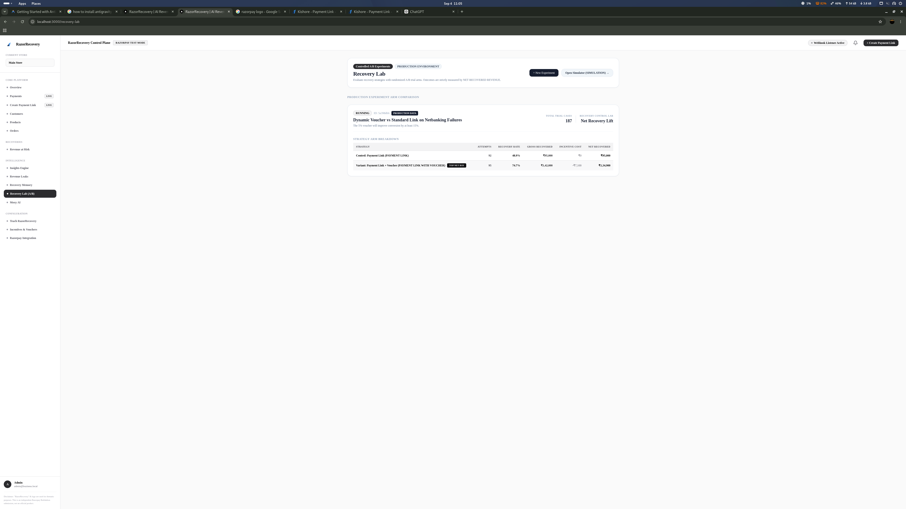

The Revenue Leak Detector actively monitors critical commerce flows to answer: "Is there a larger payment or checkout problem affecting many customers?"

## Methodology
The detector operates continuously in the background. It reads:
1. `RevenueBaselineService` to determine the 30-day historical baseline of success rates for dimensions like `PAYMENT_METHOD` (e.g., UPI, CARD).
2. The past 24 hours of data.
3. If the drop exceeds **15 percentage points**, it generates a `RevenueLeak` with severity `HIGH` or `CRITICAL`.

It automatically estimates recoverable revenue using a conservative mathematical assumption to guide merchant urgency.


### Security

# Security & Safety

## AI Safety Boundaries
The LLM cannot directly modify database state or interface with external APIs like Razorpay. 
- During `RecoveryAnalysis`, the LLM only generates an `AIDecision` record.
- During `Copilot` sessions, the LLM generates `CopilotActionProposal` records.

## Policy Enforcement
All actions are piped through the `PolicyEngine` (see `src/lib/policy.ts`). Even if the AI hallucinated a 90% discount recommendation, the deterministic Policy Engine immediately rejects it due to the `maximumDiscountPercent` constraint set by the merchant.

## Auth & Tenant Isolation
All API endpoints dynamically extract the currently authenticated user's `storeId` and `merchantId` and apply them to queries. No queries are built directly from untrusted client IDs.

## Prompt Injection Defense
Context variables (like Customer Names or Product Descriptions) are strictly passed as JSON objects appended below `SYSTEM` instructions, preventing string manipulation overrides. Zod schemas validate the output.

## Webhooks
All Razorpay webhooks require `x-razorpay-signature` verification using `crypto` against the `RAZORPAY_WEBHOOK_SECRET`. Duplicate webhook events are discarded by returning a 200 without reprocessing the state.


### Strategy Simulator

# Strategy Simulator

The Strategy Simulator allows merchants to preview counterfactual outcomes.

## How it works
It leverages `RecoveryMemory`, querying the deterministic historical performance (Net Recovered, Recovery Rate, Incentive Cost) of various strategies against specific parameters (e.g., UPI failures for Returning Customers).

**Crucial Constraints:**
- The simulator is explicitly marked as **SIMULATION ONLY**.
- It does not mutate production data.
- It never executes actual API calls or sends real notifications.


### Voucher System

# Voucher System

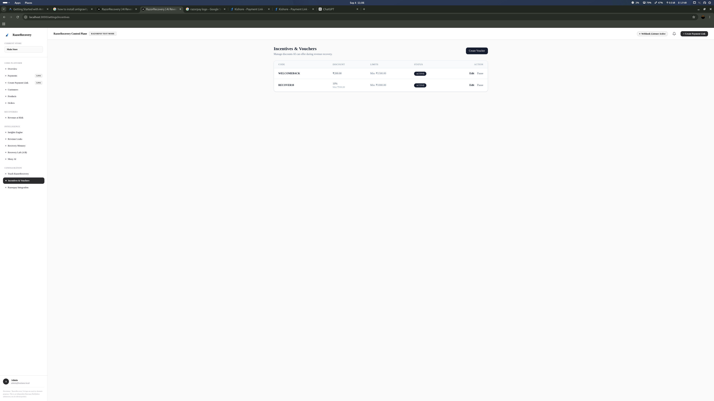

AI does *not* generate arbitrary vouchers. It merely selects from pre-approved `Voucher` entities strictly governed by the Merchant's explicit settings.

## Redemption
During outcome evaluation, `VoucherRedemption` records are cross-checked against the `RecoveryCase` and `Order`. 

## Limits
Vouchers must respect:
- `maximumDiscountPercent`
- `maximumDiscountAmount`
- `minimumOrderValue`
- `usageLimit`
- `usagePerCustomer`

Duplicate redemption attempts throw explicit bounds errors.


